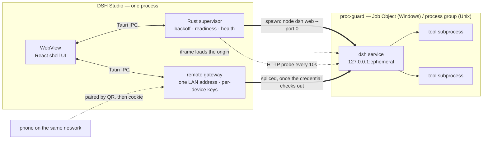

<div align="center">


# DSH Studio

**A native desktop shell for [DeepSeek Harness](https://github.com/deepseek-ai/deepseek-harness).**

Rust + Tauri 2. It supervises the local `dsh` service, reclaims every process it
spawns, and never forks the upstream project to do it.

[](https://github.com/k-ying/dsh-studio-plus/releases/latest)
[](https://github.com/k-ying/dsh-studio-plus/releases)
[](https://github.com/k-ying/dsh-studio-plus/actions/workflows/ci.yml)
[](https://github.com/k-ying/dsh-studio-plus/stargazers)
[](LICENSE)

[](https://github.com/k-ying/dsh-studio-plus/releases/latest)
[](https://github.com/k-ying/dsh-studio-plus/releases/latest)
[](https://github.com/k-ying/dsh-studio-plus/releases/latest)

Under 4 MB per installer · [all artifacts and checksums](#install) · [简体中文](README.zh-CN.md)

> **dsh-studio-plus** is a fork of [Moresyl/dsh-studio](https://github.com/Moresyl/dsh-studio)
> that tracks current Harness releases. Upstream pins `dsh` to the one release it
> ships against; this fork supports 0.1.2 and lets you pick the release yourself —
> Settings → Harness runtime lists every published version, preflights the switch
> against Studio's install-time patches, and refuses a release whose browser
> sign-in it cannot adapt to.

For a precise platform and runtime boundary, see the [support matrix](docs/support-matrix.md).
If startup or plugin installation fails, begin with the [troubleshooting guide](docs/troubleshooting.md).

<br>


**One click from a registry listing to a layer in the harness's profile** — read the
manifest, install through the harness's own plugin command, switch it off again
without uninstalling it.

</div>

---

|                                                                                                                                                                                                                                        |                                                                                                                                                                                                                                                |
| -------------------------------------------------------------------------------------------------------------------------------------------------------------------------------------------------------------------------------------- | ---------------------------------------------------------------------------------------------------------------------------------------------------------------------------------------------------------------------------------------------- |
| **⟳ Supervised, not just launched**<br>Backoff restart when it exits, and a real HTTP probe every 10 seconds to catch the harness that is alive but wedged. A restart lands on a new port and the window follows it.                   | **⛨ Nothing outlives the window**<br>Every child joins a Windows job object or a POSIX process group, so the kernel reclaims the whole tree — including the grandchildren a plain kill would orphan, and even if the shell is killed outright. |
| **⬗ A plugin marketplace in the window**<br>Search the npm registry, see what a package declares before you commit to it, install into the hosted profile through the harness's own command. Disable a plugin without uninstalling it. | **▣ Your phone, without putting the agent on the network**<br>`dsh` stays on loopback, and that is not configurable. What opens is a separate gateway on one LAN address, paired by a QR code good for one device and two minutes.             |

## What this fork adds

**Harness 0.1.2 and later, with the sign-in fence intact for everyone else.**
The 0.1.2 web surface exchanges a per-boot launch token for a SameSite cookie —
a ceremony the shell's cross-site frame can never complete. The installer
qualifies the connection package instead: a harness launched by Studio treats
loopback callers as authenticated (the exposure 0.1.1 shipped with), while a
`dsh` started from a terminal keeps the fence exactly as upstream wrote it.

**A release channel instead of a pinned version.** Settings → Harness runtime
lists every published dsh release and flags newer ones. Switching packs the two
patched packages from the registry and checks the patch seams first: a release
whose browser sign-in has moved is refused, and one that merely cannot take the
native directory picker installs without it. The dependency manifest is a
template — lockstep `@deepseek-ai/*` packages follow the selected release, and
the embedded lockfile yields to a fresh resolution for anything but the
built-in one.

## Why this exists

`dsh` is a local web service. Running it from a terminal works, but it leaves you
managing a process by hand: finding a free port, noticing when it dies, and
cleaning up the tool subprocesses it leaves behind when it does.

DSH Studio makes that a window. The design goal is that the shell should be
**boring** — it starts the service, keeps it alive, and stays out of the way of
the harness UI.

## What it does

**Supervises, rather than just launches.**
The service runs under a supervisor that restarts it with backoff when it exits.
A restart lands on a new port and the window follows it — no stale bookmarks, no
manual re-launch.

**Notices a service that is alive but wedged.**
Watching the process is only half the job: a server that has stopped answering
still has a live PID, and a TCP connect still succeeds because the kernel
completes the handshake from the listen backlog. So the supervisor sends a real
HTTP request every 10 seconds. Three consecutive misses and the harness is
recycled.

**Reclaims the whole process tree.**
The harness spawns tools, which spawn their own children. On Windows the service
is launched into a [Job Object] with `JOB_OBJECT_LIMIT_KILL_ON_JOB_CLOSE`, so the
kernel tears the tree down even if the shell is killed outright. On Unix it gets
its own process group and is signalled as a group. Closing the window leaves
nothing behind.

**Picks its own port.**
`--port 0` asks the OS for an unused one and the supervisor reads back the port
the service actually bound. There is no configured port to collide with, and no
scan-for-a-free-port race between the check and the bind.

**Brings its own Node, if the machine has none.**
Being sent to nodejs.org and told to come back is where most people stop. So the
row that says Node is missing is also a button: it reads the current LTS from the
official release index, downloads that build, checks it against the published
SHA-256 before unpacking it, and only calls it installed once the unpacked binary
answers `--version`. It lands inside the app's own data directory — nothing is
added to `PATH`, nothing is written to the registry, and deleting the directory
undoes it. There is a second mirror for places where nodejs.org is slow, serving
the same bytes.

**Installs the harness for you.**
If `@deepseek-ai/dsh` is not on the machine, the row that says so is a button.
It runs `npm install` against a private prefix inside the app's data directory —
invoking `npm-cli.js` through the detected Node binary directly, never through a
shell — and streams the output into the window while it works.

**Hosts the harness instead of replacing it.**
The harness UI is loaded in a frame under the shell's own title bar, so the
window stays movable and closable, and switching to the control panel does not
throw away a running session. Studio does not maintain an upstream fork or
vendor Harness source. Its managed, exact-version client receives one
deterministic native-workspace integration at install time; the runtime contract
verifies that known seam and enters Repair if a future upstream version moves it.

**Extends it through its own plugin system.**
There is a marketplace in the window: search the npm registry, read what a
package declares before you commit to it, and install into the harness's hosted
profile. Installation goes through the harness's own plugin command rather than
around it — no private side channel into somebody else's config. A package whose
manifest declares a profile patch becomes a layer the harness loads; one that
does not is labelled the plain library it is, instead of appearing as a plugin
that mysteriously did nothing. An installed plugin can also be switched off
without being uninstalled, so "is this the one breaking it?" costs a click
rather than a download.

**Reaches your phone without putting the agent on the network.**
Remote access is off until you open it, and opening it does not move the
service — `dsh` stays bound to loopback, which is not configurable. What opens is
a separate gateway, bound to one LAN address. Pairing is a QR code, and the code
inside it is good for one device and two minutes: scan it and that phone walks
away with a credential of its own, which is what every request after it carries.
Everything from there is spliced straight through to the harness. Paired devices
are listed on the pane, and forgetting one revokes its credential and drops the
connection it already had. Close the door and all of them die with it.

[Job Object]: https://learn.microsoft.com/en-us/windows/win32/procthread/job-objects

<div align="center">


**Open the door, scan once, and the code is gone** — the phone that redeemed it
keeps a key of its own, listed on the pane and revocable on its own.

</div>

## How it works

One process owns everything. The Rust side supervises the service and the
WebView renders the shell; the harness itself is loaded from its own origin, so
what you see is the real upstream UI rather than a re-implementation of it.



The startup sequence is worth spelling out, because every step exists to remove
a failure the terminal version has:

1. **Detect.** Every Node on the machine is probed with `--version` — including
   the ones a version manager installed but never put on `PATH`. The newest one
   that meets the minimum wins.
2. **Install, if needed.** `@deepseek-ai/dsh` goes into a private prefix under
   the app's data directory. Nothing is written to your global npm root.
3. **Launch.** The service is spawned into a Job Object (Windows) or its own
   process group (Unix), with `--port 0` so the kernel assigns the port.
4. **Read back.** The supervisor parses the readiness line the service prints
   and learns the port it actually bound. No guessing, no scanning.
5. **Host.** The window loads that origin in a frame, and keeps probing it over
   HTTP. Three consecutive misses and step 3 runs again.

<div align="center">


<sub>The control panel after all five steps: what was detected, what the kernel
handed out, and the service's own output. Every image on this page is captured
from the shipped UI by the deterministic script in <a href="media/"><code>media/</code></a>,
against a stand-in backend — which is why no real home directory, LAN address or
pairing key appears in any of them.</sub>

</div>

## Install

Grab an installer from [Releases]. Every tagged version is built by CI for five
targets:

| Platform            | Artifact                                                |
| ------------------- | ------------------------------------------------------- |
| Windows x64         | `.exe` (NSIS), `.msi`, and a standalone `-portable.exe` |
| macOS Apple Silicon | `.dmg`                                                  |
| macOS Intel         | `.dmg`                                                  |
| macOS Universal     | One `.dmg` for both Intel and Apple Silicon             |
| Linux x64           | `.AppImage`, `.deb`, `.rpm`                             |

The Universal macOS image is the lightweight edition. Full / Offline images stay
architecture-specific because their embedded Node runtime is native code.

Or through a package manager. The manifests all live in [`packaging/`](packaging)
and are generated from a real release, so the version and the SHA-256 in them are
never hand-typed:

```powershell
scoop bucket add dsh https://github.com/k-ying/dsh-studio-plus
scoop install dsh-studio
```

winget, Homebrew Cask and AUR manifests are written and validated but not yet
submitted to their registries — [`packaging/README.md`](packaging/README.md) says
exactly what each one is still waiting on.

> **Signing.** The release pipeline signs macOS builds with an Apple Developer ID,
> notarizes and staples them, and signs the Windows installers through Azure
> Artifact Signing when those credentials are configured. Tauri updater signing
> and the complete non-empty artifact matrix are mandatory. Builds without
> platform credentials carry an explicit CI warning; Windows may show an unknown
> publisher and macOS may require approval in System Settings → Privacy & Security.

Downloading from a mirror rather than from GitHub? Releases carry a
`SHA256SUMS.txt`; [`packaging/MIRRORS.md`](packaging/MIRRORS.md) covers checking a
download against it, and why the checksum has to come from GitHub even when the
bytes did not.

No Node.js on the machine is fine — the app installs one for you. What changed
between versions is in the [changelog](CHANGELOG.md).

[Releases]: https://github.com/k-ying/dsh-studio-plus/releases

## Status

The v0.9.x line is production-ready for supported desktop workflows. Windows,
Linux, and macOS artifacts are built and tested in the release matrix; platform
publisher signing and physical Apple-device acceptance remain separately
tracked release conditions.

|                                                |                                                                     |
| ---------------------------------------------- | ------------------------------------------------------------------- |
| Environment detection, one-click install       | ✅                                                                  |
| Supervisor, backoff restart, health probing    | ✅                                                                  |
| Process-tree reclamation (Windows / Unix)      | ✅                                                                  |
| Harness hosting, log console, English + 中文   | ✅                                                                  |
| Plugin marketplace — install, switch, remove   | ✅                                                                  |
| Remote access, single-use QR, revocable keys   | ✅                                                                  |
| Signed in-app update, checked on a schedule    | ✅                                                                  |
| Verified on Windows 11                         | ✅                                                                  |
| macOS / Linux platform builds                  | ✅ compiled and tested in the platform CI matrix                    |
| Node runtime fetched and verified on demand    | ✅ no system Node needed                                            |
| Updater signatures and `SHA256SUMS.txt`        | ✅ mandatory; OS signing is applied when credentials are configured |
| Download page, five packaging channels         | ✅ manifests generated and validated in the release pipeline         |
| Tray icon, close-to-tray while serving         | ✅                                                                  |
| Native context menus, saved window bounds      | ✅                                                                  |
| Light and dark, following the system or not    | ✅                                                                  |
| Profile manager, import/export and comparison  | ✅                                                                  |
| Terminal, session search/usage/export, windows | ✅                                                                  |
| Compatibility / Extended / Advanced surfaces   | ✅                                                                  |
| Fixed or random loopback port                  | ✅ occupied fixed ports fail clearly                                |
| Renderer-independent startup recovery          | ✅ static native retry/diagnostics/quit                             |
| Read-only Host plugin contract                 | ✅ Host Protocol 1; no package or command authority                 |
| Silent self-update                             | ⏳ planned                                                          |
| Packaged releases                              | ✅ Windows installer + portable, Linux, macOS native + Universal    |

## Design notes

Three decisions shape everything else here, and each one gives something up.

**The upstream service is hosted, not forked.** Vendoring the harness into this
repository would buy direct control of its UI, at the price of merging every
upstream release forward forever. Hosting it unmodified gives up that control —
the plan for extending the UI is to go through the harness's own plugin system
rather than around it — and takes upstream updates for free. A plugin installed
from the shell's own marketplace is the supported way to change what the harness
does.

**Shutdown is the kernel's job, not a signal's.** Killing the process you
spawned does not kill the tools it spawned, and on Windows there is no process
group to fall back on — so a shell that crashes can strand a compiler, a test
runner, or a language server nobody can now see. A Job Object makes the kernel
responsible for the whole tree, which is why closing this window is enough even
when the closing was not graceful.

**The service stays on loopback; reach is a separate, authenticated door.**
Binding an agent that can run shell commands to a LAN interface is not something
to do by default, and not something to do without a credential. Remote access is
off until you turn it on, and when you do, a gateway holding one credential per
paired device proxies to a service that never stopped being loopback-only. Any
one of those credentials can be taken back on its own, mid-connection.

## Requirements

- **Nothing you have to install first.** DSH Studio needs Node.js 22.19 or newer to
  run the harness, and it finds one if you have it — including the ones a version
  manager installed but never put on `PATH`. If you do not, it downloads and
  verifies one into its own data directory. The harness itself is installed for
  you either way.
- Releases provide two editions. **Lite** is the smaller installer and downloads
  verified runtimes only when needed. **Full / Offline** carries the platform's
  Node.js archive and the complete tested DSH dependency closure, verifies both
  again before extraction, and can finish first-run setup without a network.
- Windows 10/11 with WebView2 (present on Windows 11 by default).

## Building from source

```sh
pnpm install
pnpm tauri dev      # run it
pnpm bundle:local   # produce unsigned installers for local verification
# The release workflow prepares src-tauri/runtime-cache/offline and merges
# src-tauri/tauri.full.conf.json to produce the Full / Offline edition.
```

`bundle:local` deliberately skips updater and platform signing because developer
machines do not carry the release private keys. Official releases are built by the
release workflow, which fails closed unless the updater artifacts are signed.

Checks:

```sh
pnpm lint                                          # ESLint, zero warnings
pnpm exec tsc --noEmit                             # strict TypeScript
pnpm test                                          # store and i18n behaviour
cargo test --manifest-path src-tauri/Cargo.toml --workspace
```

## Layout

```
src/                       React 19 + Tailwind 4 shell UI
src-tauri/src/harness/     supervisor, readiness parsing, health probe, install
src-tauri/src/remote/      LAN gateway, pairing codes, QR, address selection
src-tauri/src/plugins/     registry search, profile inspection, install/switch/remove
src-tauri/crates/
  node-runtime/            find a usable Node on this machine
  proc-guard/              kill a process tree and mean it
```

`node-runtime` and `proc-guard` are deliberately free of Tauri and of anything
specific to this app — they are two small crates that answer two questions any
desktop app wrapping a Node service has to answer.

## FAQ

Documentation hub: [Docs](docs/index.md) · [User guide](docs/user-guide.md) · [Troubleshooting](docs/troubleshooting.md) ·
[Architecture](docs/architecture.md) · [Plugin and catalog development](docs/plugin-development.md) ·
[Plugin interoperability contract](docs/plugin-interoperability.md) ·
[Protocol 3 SDK](sdk/README.md) · [Current roadmap](docs/ROADMAP.md).

**Does this replace the harness UI?**
No. The harness is loaded from its own service, unmodified. What the shell adds
is the window around it, and everything needed to keep the service alive inside
that window.

**Do I need to install `dsh` myself?**
No. If it is missing, the row that says so is a button. It installs into a
private prefix inside the app's data directory rather than your global npm root,
so nothing on the rest of your machine changes.

**Do I need Node.js installed?**
No. If you have one the shell uses it — including the ones nvm, fnm or Volta
installed but never added to `PATH`. If you do not, the row that says so is a
button: it fetches the current LTS, checks it against the published SHA-256, and
keeps it inside the app's own data directory. Your `PATH` is not touched, so this
cannot disturb a Node you rely on for something else.

**Which port does it use?**
Whichever one the kernel hands out. `--port 0` means there is no configured port
to collide with, and the supervisor reads the real port back from the service's
own readiness line. This is also why a restart can land somewhere else and the
window simply follows.

**I closed the window and the harness kept running.**
That is deliberate, while a service is up. The window hides to the tray and the
service keeps working; the close button says so on hover. Quit from the tray
menu to stop everything.

**Does closing the app leave processes behind?**
It should not, including if the shell is killed outright rather than closed.
That is what `proc-guard` is for. If you ever find an orphan, that is a bug
worth reporting.

**How do I use it from my phone?**
Open the Remote pane, press Open access, and scan the code with the phone's
camera. Both devices have to be on the same network — there is no relay and no
account, so nothing about the pairing leaves the room. The code is good once and
for two minutes; the phone that redeems it gets a key of its own, and the pane
lists it afterwards, so that key can be taken back without disturbing anything
else that paired.

**Can I install any npm package as a plugin?**
You can install any package, but only one that declares a profile patch in its
manifest becomes an active layer — the marketplace says which is which before
you install. Plugins land in the harness's own profile through its own plugin
command, so what the shell installs is exactly what the harness would have.

**Is my data sent anywhere?**
The shell makes exactly one request you did not ask for: a GET to this
repository's public release feed, shortly after launch and every six hours
after, to find out whether there is a newer version. No account, no identifier,
nothing about your machine. That is the whole list.

Everything else stays where it is. The service is bound to loopback and that is
not a setting — an agent that can run shell commands has no business being
reachable by default. Remote access does not change it: the service stays on
loopback, and what listens on the network is a gateway that will not forward a
byte without a credential it minted itself. It is off until you switch it on,
and it goes off again the moment the harness stops. What the harness itself does with your
API keys is upstream's business, not this project's.

## Community

| Where                                                                                              | For                                                                                              |
| -------------------------------------------------------------------------------------------------- | ------------------------------------------------------------------------------------------------ |
| [Report a bug](https://github.com/k-ying/dsh-studio-plus/issues/new?template=bug_report.yml)           | The form asks for the platform, the Node and the log up front — the three things triage needs.   |
| [Ask for a feature](https://github.com/k-ying/dsh-studio-plus/issues/new?template=feature_request.yml) | Including "the harness can do this from a terminal and the window cannot".                       |
| [Report something privately](https://github.com/k-ying/dsh-studio-plus/security/advisories/new)        | Anything about the gateway, the pairing keys, or the supervisor. See [SECURITY.md](SECURITY.md). |
| [The harness itself](https://github.com/deepseek-ai/deepseek-harness/issues)                       | The agent, its UI, its models. This repository is only the window around it.                     |

Participation is governed by the [Code of Conduct](CODE_OF_CONDUCT.md)
([中文](CODE_OF_CONDUCT.zh-CN.md)).

Issues in Chinese are welcome and get answered in Chinese — the app, the README,
the changelog and the contributing guide are all bilingual, and so is triage.

## Contributing

Issues and pull requests are welcome — see [CONTRIBUTING.md](CONTRIBUTING.md)
([中文](CONTRIBUTING.zh-CN.md)) for how to set up, what the checks are, and how
commits are worded here.

The one house rule is in the code style: comments explain _why_ a thing is the
way it is, not what the line below does.

## License

[MIT](LICENSE).

DSH Studio is an independent project. It is not affiliated with or endorsed by
DeepSeek.
